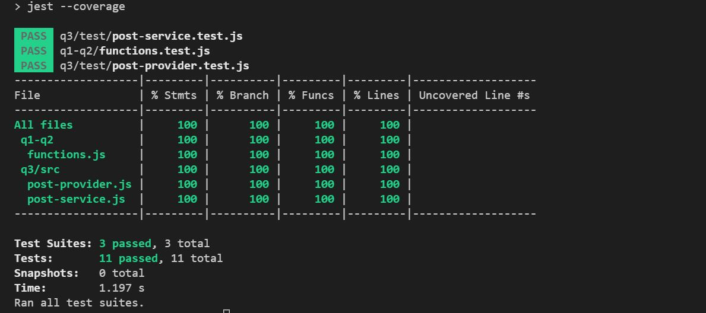

# Week5-testing-mehmet-can-boz
This is a Trendyol Frontend Bootcamp testing homework.

## Challenge

* q1-The test of the division function that takes 2 parameters, throws an error if the parameters are not numbers or the 2nd parameter is 0.
* q2-Testing the function that returns the first letters of a given parameter in capital letters
* q3-Testing a function that returns the title of posts of user who post most [POST API](https://jsonplaceholder.typicode.com/posts)

##  Testing Result



## Installation

Use the package manager [npm](https://www.npmjs.com/) to install foobar.

```bash
clone project
npm install
npm run test
npm run test:coverage
```

## Contributing
Pull requests are welcome. For major changes, please open an issue first to discuss what you would like to change.

## License
No License
